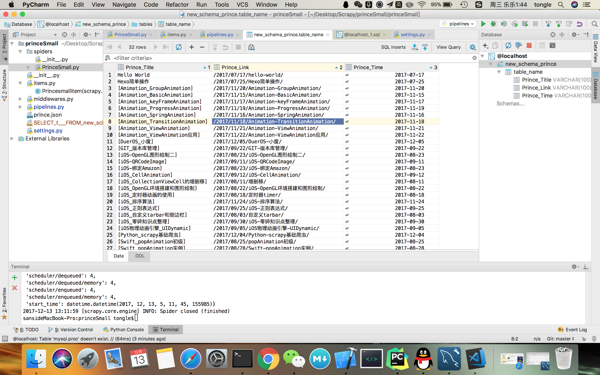

# Spiders
使用scrapy的spiders进行多网页爬取保存到本地

### Princesmall.py中 导入头文件
注意：..items

     from scrapy.spiders import Spider
     from scrapy.selector import Selector
     from scrapy.http import Request
     import scrapy
     from ..items import PrincesmallItem

#### 获取princesmall的所有title，link，time
注意：要用yield item。要用yield item。要用yield item。重要说三遍

    class princesmallSpider(Spider):
          name = "princesmall"

          download_delay = 1

          allowed_domains = ["princesmall.cn"]
         start_urls = [
        "http://princesmall.cn"
          ]

    def parse(self, response):
        sel = Selector(response)
        sites = sel.xpath('//header[@class="post-header"]')

        for site in sites:
            item = PrincesmallItem()
            title = site.xpath('h1/a/text()').extract()
            link = site.xpath('h1/a/@href').extract()
            time = site.xpath('div/span/time/text()').extract()
            item['title'] = [t.encode('utf-8') for t in title]
            item['link'] = [l.encode('utf-8') for l in link]
            item['time'] = [m.encode('utf-8') for m in time]
            yield item

        # title_prince = sel.xpath('//header[@class="post-header"]/h1/a/text()').extract()
        # url_prince = sel.xpath('//header[@class="post-header"]/h1/a/@href').extract()
        # time_prince = sel.xpath('//header[@class="post-header"]/div/span/time/text()').extract()
        #
        # item['title'] = [t.encode('utf-8') for t in title_prince]
        # item['link'] = [l.encode('utf-8') for l in url_prince]
        # item['time'] = [m.encode('utf-8') for m in time_prince]
        #
        # yield item

        print
        item, '------'
        urls = sel.xpath('//nav[@class="pagination"]/a[@class="extend next"]/@href').extract()
        for url in urls:
            url = "http://princesmall.cn" + url
            yield Request(url, callback=self.parse)

            # yield scrapy.Request(url,callback=self.parse)

#### 获取w3cshoolxml的title，link，desc
     
     class w3schoolSpider(Spider):
           name = "w3school"
           allowed_domains = ["w3school.com.cn"]
           start_urls = [
        "http://www.w3school.com.cn/xml/xml_syntax.asp"
          ]

    def parse(self, response):
        sel = Selector(response)
        sites = sel.xpath('//div[@id="navsecond"]/div[@id="course"]/ul[1]/li')
        items = []

        for site in sites:
            item = PrincesmallItem()

            title = site.xpath('a/text()').extract()
            link = site.xpath('a/@href').extract()
            desc = site.xpath('a/@title').extract()

            item['title'] = [t.encode('utf-8') for t in title]
            item['link'] = [l.encode('utf-8') for l in link]
            item['desc'] = [d.encode('utf-8') for d in desc]
            items.append(item)

        return items

### pipelines.py

注意：保存到本地，text，json，xml...有时候用ensure_ascii = False.有时候要用decode("unicode_escape").初学者还没分清区别
        
    import codecs
    import json

    class PrincesmallPipeline(object):
          def __init__(self):
              self.file = codecs.open('prince.json', 'w', encoding='utf-8')
            # self.file = codecs.open('princesmall.json','wb',encoding='utf-8')
            # self.file = codecs.open('w3school_data_utf8.json', 'wb', encoding='utf-8')

    def process_item(self, item, spider):
        # line = json.dumps(dict(item), ensure_ascii=False) + '\n'
        # self.file.write(line)
        line = json.dumps(dict(item)) + '\n'
        self.file.write(line.decode("unicode_escape"))
        return item
        
### items.py 中仍然不变

    import scrapy
    from scrapy.item import Item, Field

     class PrincesmallItem(scrapy.Item):
       # define the fields for your item here like:
       # name = scrapy.Field()
         title = Field()
         link = Field()
         desc = Field()
         time = Field()

         pass

### 下载MySQL
Mac ：

官网下载dmg文件打开

homebrew下载

#### pipelines.py

导入头文件：

     from twisted.enterprise import adbapi
     import MySQLdb
     from MySQLdb import cursors
     from scrapy import log

类方法
    
    class PrincesmallSQLPipeline(object):

    def __init__(self):
        self.dbpool = adbapi.ConnectionPool("MySQLdb",

                                            host = "localhost",
                                            db = "new_schema_prince",
                                            user = "root",
                                            passwd = "princesmall",
                                            cursorclass = MySQLdb.cursors.DictCursor,
                                            charset = "utf8",
                                            use_unicode =True
                                            )
    def process_item(self,item,spider):

        query = self.dbpool.runInteraction(self._conditional_insert,item)
        query.addErrback(self.handle_error)
        return item
    def _conditional_insert(self,tb,item):
        prince_title = item['title']
        prince_link = item['link']
        prince_time = item['time']
        # print prince_link, prince_title, prince_time, '--------'

        # 删除所有数据
        # tb.execute("DELETE FROM TABLE_NAME ")

        # 插入数据，prince_link[0]取出list列表中的数据
        tb.execute("INSERT INTO  TABLE_NAME (Prince_Title, Prince_Link, Prince_Time) VALUES ('%s', '%s', '%s')" % (prince_title[0], prince_link[0], prince_time[0]))

        log.msg("item data in :%s" % item, level=log.DEBUG)
    def handle_error(self,e):
        log.err(e)

